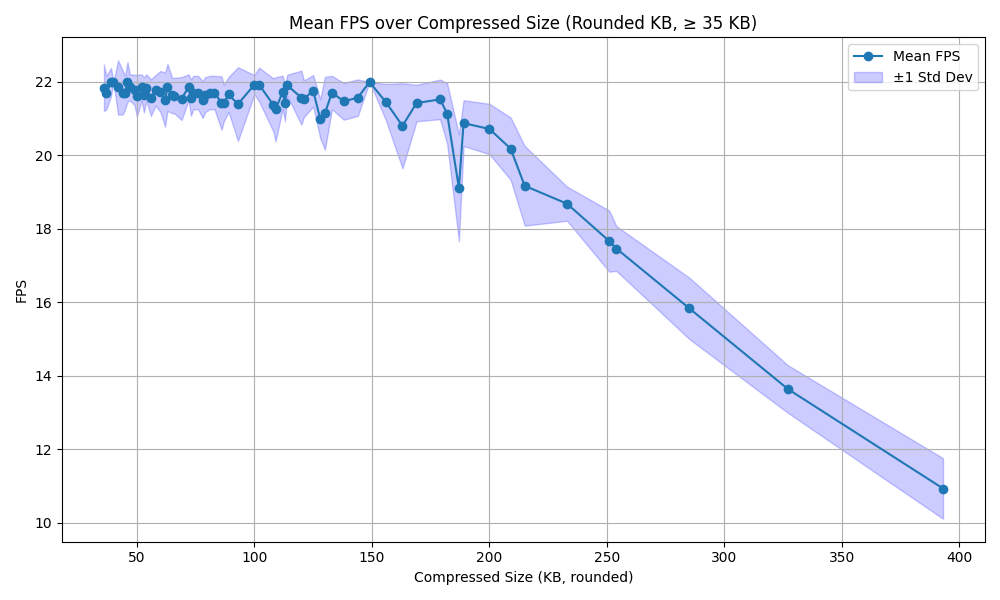
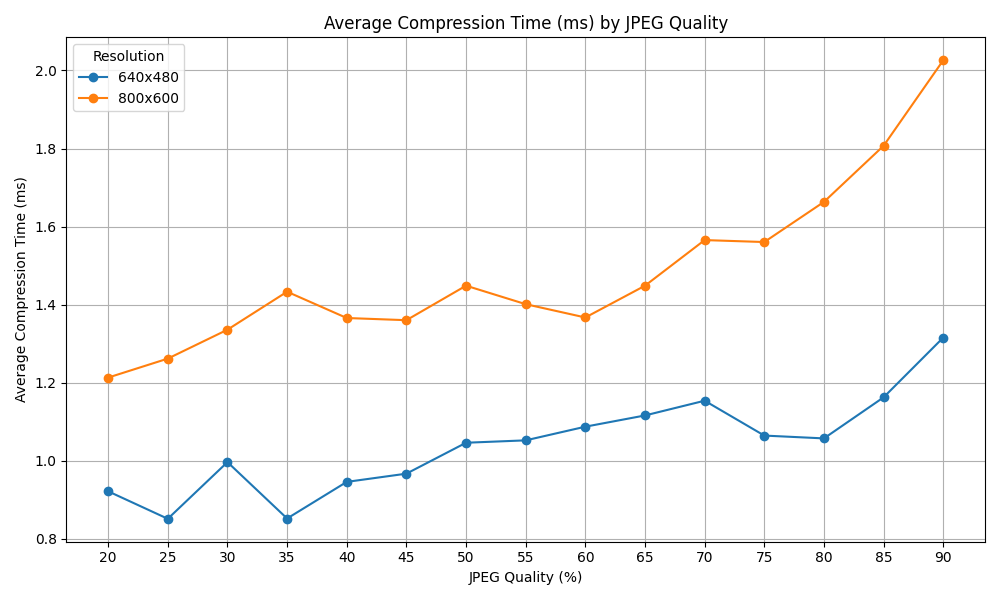
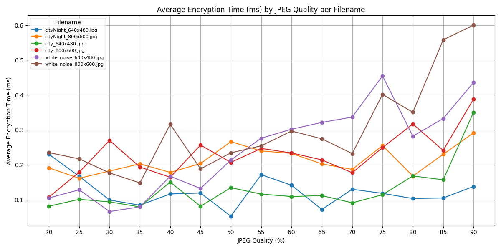
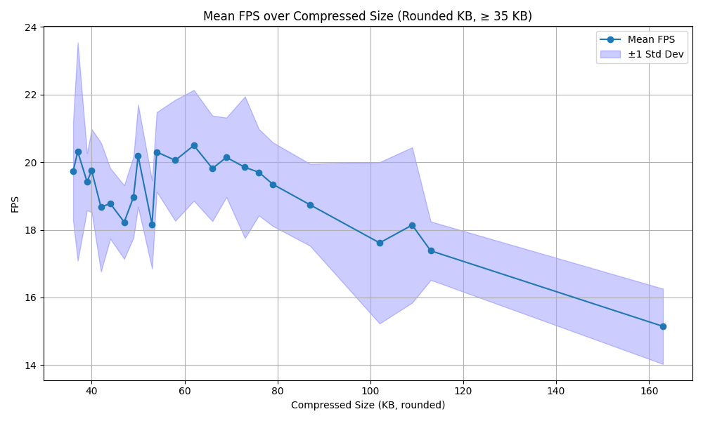

# 📡 5GWebRtc – Encrypted Image Streaming Testbench over WebSocket

This repository provides a **lightweight and flexible testbench** for evaluating real-time image streaming performance using:

- 📦 **JPEG compression**
- 🔐 **AES-256 encryption (CBC mode)**
- 🌐 **WebSocket-based communication**

It's ideal for **network performance testing** across modern wireless technologies such as:
- **Wi-Fi 6 / Wi-Fi 5**
- **5G / 4G / 3G**
- **2.5G & legacy mobile networks**
---

## 📦 Components

### 🟦 `imageTestBenchSender.py` – **Sender**
Simulates a video source that:
- Loads test images from `test_images/`.
- Compresses them at multiple JPEG quality levels (20–90%).
- Encrypts them using AES-256-CBC.
- Sends encrypted frames via WebSocket at 30 FPS.
- Includes metadata: resolution, size, compression/encryption time, JPEG quality.

➡️ Sends this data to the signaling server, which relays it to a receiver.

---

### 🟩 `imageTestBenchReceiver.py` – **Receiver**
Receives and displays encrypted image streams:
- Connects to the signaling server.
- Decrypts and decompresses each frame.
- Displays real-time overlay (size, quality, timing, FPS).
- Records a `.avi` video stream.
- Logs all performance data into `stream_log.csv`.

🧠 Uses the metadata to track performance over time and per quality level.

---

### 🟨 `signalingServer.py` – **Signaling Server**
A minimal WebSocket relay:
- Forwards incoming WebSocket messages from sender → receiver.
- Maintains a simple client list.
- No TURN/STUN or ICE negotiation – just basic message forwarding.

---

### 📈 `imageTestBenchGraph.py` – **Graph Generator**
Generates performance graphs from `stream_log.csv`:
- FPS vs JPEG Quality / Size
- Compression & Encryption time vs JPEG Quality
- Per-resolution & per-filename breakdown
- FPS vs Compressed Size (with ±1 std deviation)
- Outputs graphs as `.png` and a summary CSV

📊 Results are used for performance evaluation and tuning.

---

## 🧪 Running the Testbench

1. **Start the Signaling Server**

python signalingServer.py (For now it was running on a local signaling server that is accessible over the web, needed for 5G benchmark)

2. **Start the sender**

python imageTestBenchSender.py  <ws://signalingserver:9000> 

3. **Start the receiver**

python imageTestBenchReceiver.py <ws://signalingserver:9000> 

### 📂 Test Process

1. A set of **test images** is streamed (e.g. city scenes, white noise).
2. Each image is sent at two resolutions (`640x480`, `800x600`) and multiple **JPEG quality levels** (20% to 90%).
3. All frames are **AES-256 encrypted**, base64 encoded, and streamed over WebSocket.
4. The **receiver decrypts** and displays the frames while logging real-time performance data (FPS, size, latency).
5. A `stream_log.csv` file is generated.
6. The `imageTestBenchGraph.py` script analyzes this file and **automatically generates all relevant graphs**.

> You can add any custom image(s) and test in different network settings to the `test_images/` folder to extend or repeat the test with different visual content.

# 📊 Testbench Results – 5GWebRtc

## 🎥 Recording

A screen recording of the live stream test in 640×480 resolution:

▶️ (./testbench/wifiLocal/recording_640x480.avi)

---

## 📈 Performance Summary

### 1. Mean FPS over Compressed Size

- **FPS remains stable** (~22 FPS) for images ≤ 200 KB.
- **Performance drops sharply** beyond 200 KB, hitting ~11 FPS at ~390 KB.
- 🔎 *Recommendation*: Limit image size to ≤ 200 KB for real-time streaming.

---

### 2. Average Compression Time (JPEG Quality)

- **Resolutions tested**: `640x480` and `800x600`.
- **Compression time increases** with higher JPEG quality.
  - 640x480: ~0.9 to 1.3 ms
  - 800x600: ~1.2 to 2.0 ms
- ⚖️ *Recommendation*: Use JPEG quality between 50–70% for real-time performance.

---

### 3. Average Encryption Time (JPEG Quality by File)

- **Encryption overhead is low**, mostly between 0.1–0.6 ms.
- **White noise images** consistently take more time to encrypt.
- AES-256-CBC encryption scales slightly with file complexity and size.

---

### 4. Summary Log (CSV)

📄 [`stream_log.csv`](./testbench/wifiLocal/stream_log.csv)

Includes per-frame metrics:
- JPEG quality
- Compression time (ms)
- Encryption time (ms)
- Compressed size (KB)
- Achieved FPS
- Filename and resolution

---

## 🧠 Key Insights

- 💡 Optimal JPEG Quality: **50–70%**
- 🎯 Target Size: **≤ 200 KB** for smooth ~22 FPS
- 🔐 AES-256 Encryption: Low latency impact
- 🧪 Dataset includes cityscapes and synthetic noise for robustness testing

---

---

## 📶 Real-Time Streaming Over 5G (Raspberry Pi)

One of the test scenarios used in this project involved streaming from a **Raspberry Pi 4** connected via **5G**, while the **signaling server** was running locally on the same machine or network as the Wi-Fi tests.

### 🔍 Setup Details

- **Sender**: Raspberry Pi 4 with a Netgear Nighthawk M6 Pro 5G router over Orange 5G
- **Receiver & Signaling Server**: Local machine on same LAN (Wi-Fi)
- **Streaming**: AES-encrypted JPEG images over WebSocket

### 📈 Results Summary

- 🧠 The Pi successfully compressed, encrypted, and streamed image data in real-time.
- 📦 For compressed sizes **≤ 80 KB**, it maintained ~20 FPS.
- 📉 FPS gradually dropped as image size increased, reaching ~15 FPS at ~160 KB.
- 🎯 Sweet spot: **35–80 KB per image** for smooth real-time streaming over 5G from an embedded device.

### ✅ Key Insights

- 💡 Demonstrates that **edge streaming over 5G** from resource-constrained hardware is viable.
- 🔐 End-to-end encryption and metadata tracking worked seamlessly.
- ⚖️ Trade-off observed between image quality and FPS, especially beyond 100 KB.

This real-world test highlights how this testbench can be used to simulate and analyze **5G edge deployment scenarios** using Raspberry Pi-class devices.

📂 All results were generated using the included graph and logging scripts in this repository.

Feel free to open an issue or discussion for questions about the benchmarking methodology.
